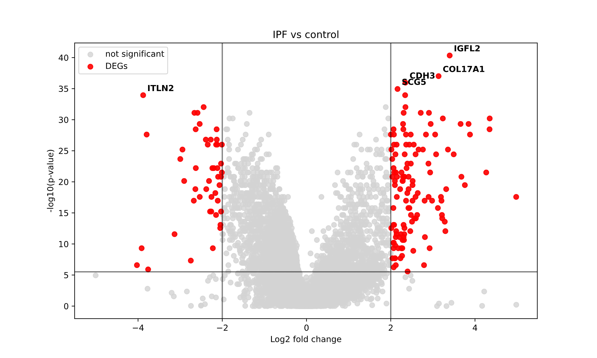
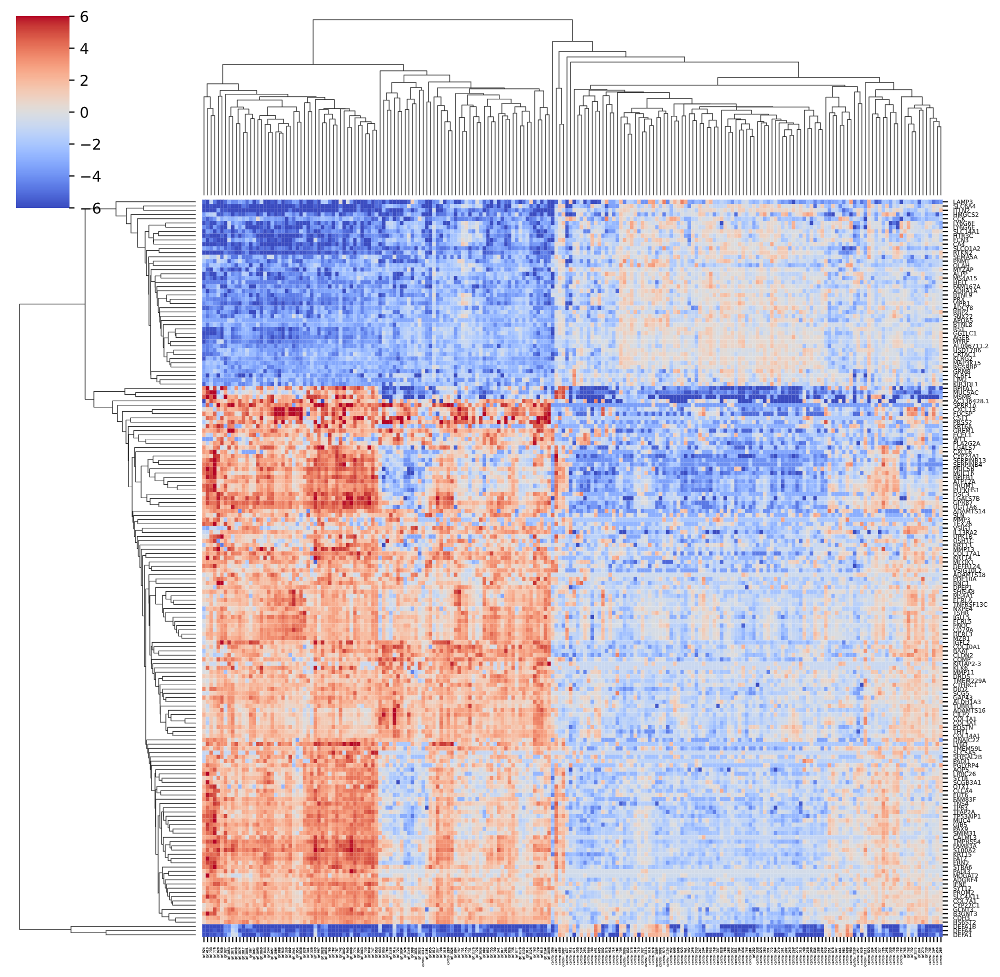
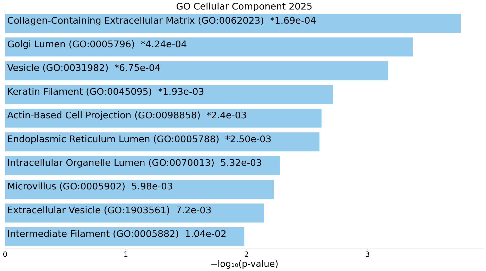
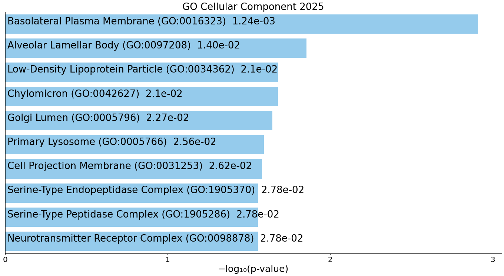
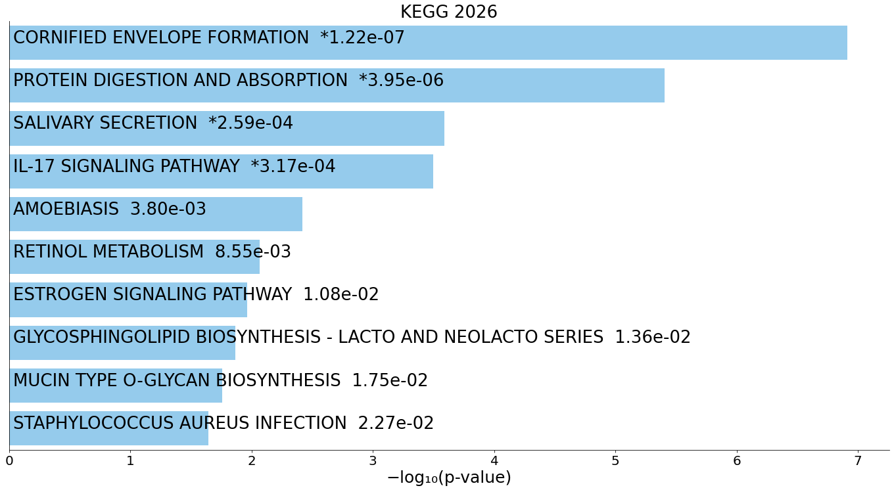
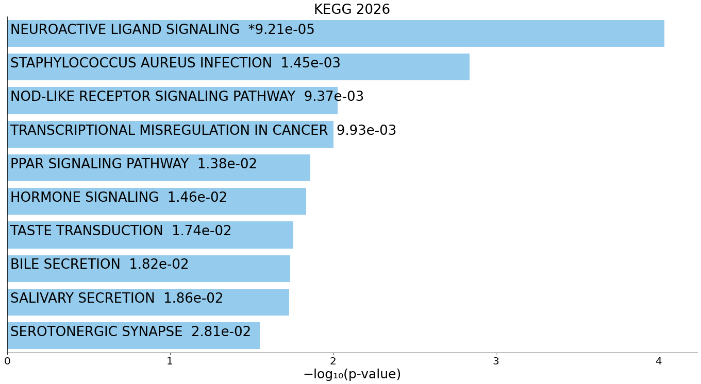
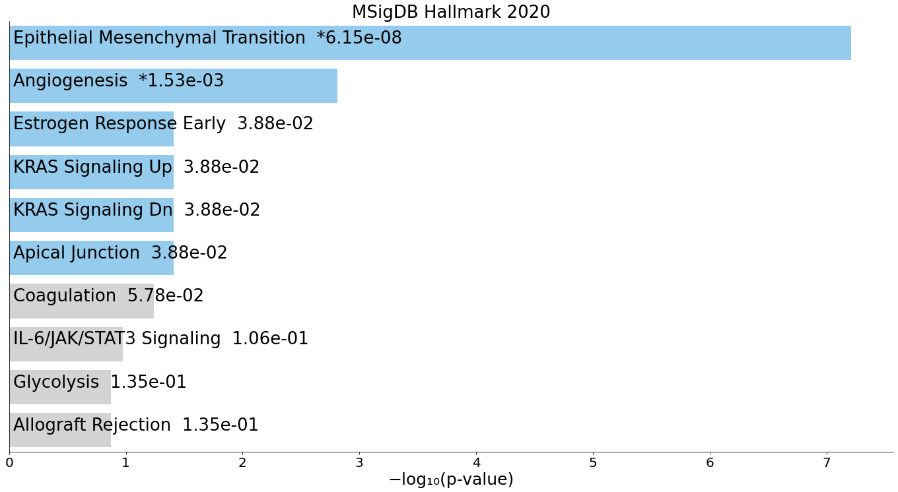
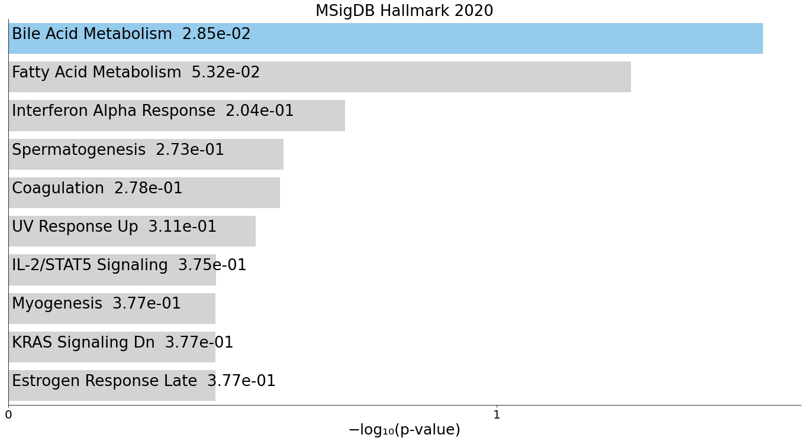

# IPF-differential-expression-analysis
(a very simple bioinformatics project exploring gene expression in idiopathic pulmonary fibrosis (IPF))

date: 19 march 2026 – 23 march 2026
 
i started this project out of pure curiosity to see what bioinformatics actually looks like in practice. following this youtube video and a publicly available dataset on idiopathic pulmonary fibrosis (IPF), i followed a basic workflow to explore gene expression patterns. i barely had any prior python knowledge before doing this project (i’m not fully versed on python yet) and you could say i learnt a tiny bit of python as i went, so you’ll find plenty of random notes to myself in the code/this file! this probably looks a little all over the place in the eyes of a seasoned cs student, so don’t come at me :(

### the dataset and the tools i used
1. [data source](https://www.ncbi.nlm.nih.gov/geo/query/acc.cgi?acc=GSE150910)
2. [the paper](https://pmc.ncbi.nlm.nih.gov/articles/PMC7667907/)
3. language: Python 3.13.9 in Jupyter Notebook
4. key libraries: Numpy, Matplotlib + seaborn, SciPy

### steps!
1. 	data cleaning: removed CHP (chronic hypersensitivity pneumonitis) data to compare only IPF and normal patients. normalized the counts so the comparison done is fair
2. 	finding DEGs
3. 	visualization: created heatmap and volcano plot
4. 	plugged the genes into Enrichr to find the biological meaning

### the results + interpretation and what i learnt
IPF is a serious chronic (long term) disease that affects the tissue surrounding the air sacs, or alveoli, in the lungs. this condition develops when that lung tissue becomes thick and stiff for unknown reasons. over time, these changes can cause permanent scarring in the lungs, called fibrosis, that makes it progressively more difficult to breathe. (copied this off of [this website](https://www.nhlbi.nih.gov/health/idiopathic-pulmonary-fibrosis)).

#### 1. the volcano plot
   
   
   
this is the first time i’ve come across this kind of graph so i had to learn how its interpreted first. this kind of plot tells us exactly what genes are most strongly associated with causing scarring in IPF.

- the x-axis (log2 fold change) tells us the magnitude of the change.
- the y-axis (-log10 p-value) tells us the statistical significance. the higher the dot is, the more certain we can be that the change is more probable than just a random fluke.
- points on the right (positive) are upregulated genes.
- points on the left (negative) are downregulated genes.

i labelled the most extreme genes, here’s the details i learnt about them (all of the info here are from GeneCards):

- **IGFL2**: belongs to the insulin-like growth factor and belongs to a family of signalling molecules that play critical roles in cellular energy metabolism and in growth and development, especially prenatal growth (Emtage et al., 2006 [PubMed 16890402]). essentially, a growth signal. 
- **COL17A1**: This gene encodes the alpha chain of type XVII collagen. unlike most collagens, collagen XVII is a transmembrane protein. this gene makes up the scar tissue.
- **CDH3**: "glue" protein, so helps cells stick together. in the lung, having too much of this glue protein makes the tissue rigid and fibrous instead of flexible and stretchy.
- **SCG5**: acts like a project manager on a construction site, if i had to use an analogy. in context of IPF, it makes sure that all the other proteins are packaged and shipped out correctly to build the scar tissue. 
- **ITLN2** (top left, hence downregulated): downregulated means that the rate of gene expression is low. since this gene is so high up on the downregulated side, this means that the cells are barely expressing this. 
- ITLN2 usually helps protect the lung lining and manage the immune response. this means that patients with IPF have lost the ability to protect itself.

the gray dots are genes that didn’t change enough to look suspicious. the red dots are the 174 DEGs (differentially expressed genes). there are more red dots on the right than left. this tells us that IPF has more upregulated genes than downregulated ones.  

#### 2. heatmap

   

again, this was also my first time coming across a heatmap. a heatmap, from what i've learnt, is a type of visual fingerprint of the entire experiment. while the volcano plot shows the individual genes, this map shows how those genes behave across every single patient sample. 

- the red blocks (positive) are upregulated genes.
- the blue blocks (negative values) are downregulated genes.
- while/pale colours are genes that have little to no change compared to the mean.
  
there are 4 quadrants, but we mainly look at the:
- top left blue block: these are the genes that are normally "on" in healthy lungs, but have been turned off in IPF patients.
- the bottom left red block: these genes are turned off in healthy lungs, but are turned on in IPF patients. 
- there are some white boxes on the top and on the left side of the heatmap, and they kind of resemble phylogenetic trees i've come across before. these are called dendograms. the top dendogram (the samples) groups the patients, and there are two main groups (control vs IPF samples). if a control sample accidentally ended up in the IPF branch, it would tell us that the patient’s biological profile looks more like a sick person's than a healthy one. 
- the left denogram (genes) groups genes that behave the same way. for example, all the genes involved in extracellular matrix organization will probably be clustered together because they all turn on at the same time to build the scar tissue.
  
this heatmap is proof that all the 174 genes found are consistent and shows a sharp contrast between healthy and sick tissue (the quadrants). 

now on to the Enrichr stuff:

#### 3. GO biological process, KEGG, MSigDB Hallmark 

GO biological process is a type of interpretation that plugs in the genes found into its system, compares it with the library derived from the Gene Ontology (GO) project and is one of the most widely used tools for interpreting what a list of genes actually does within a living system. 

KEGG (Kyoto Encyclopedia of Genes and Genomes) is a database that maps genes to specific molecular pathways. it focuses on how genes work together to complete a task. 

the Hallmark collection is part of the Molecular Signatures Database (MSigDB). unlike KEGG, which is a detailed map, Hallmark is a summary condenses thousands of messy, overlapping gene lists into 50 clear biological states.

when i ran the genes through Enrichr and the graphs for these processes came up, i felt a rush of elation because everything came into place and finally made sense. all this time i was poking at codes and trying to make sense of some rather daunting graphs :( so seeing this felt so cool! 

**GO cellular component (upregulated genes)**

**GO cellular component (downregulated genes)**

**KEGG (upregulated genes)**

**KEGG (downregulated genes)**

**Hallmark (upregulated genes)**

**Hallmark (downregulated genes)**

**A. upregulated gene**

1. GO cellular component:

the most activity is shown as "Collagen-Containing Extracellular Matrix." this means that the damage is filling air spaces between the cells. 

there's also "Keratin Filament" which is a protein that makes up hair and nails. 

"Golgi Lumen, Endoplasmic Reticulum (ER) Lumen, and Vesicles" are also quite active which means these cells are working a lot to ship collagen and keratin into the lung tissue.

2. Hallmark:

"Epithelial Mesenchymal Transition (EMT)" is on top of the list. it is cellular process where epithelial cells lose polarity and adhesion and play key roles in development, wound healing, and cancer metastasis. this shows that healthy lung cells are scarring.

"Angiogenesis" is a process where the body grows new blood vessels.

3. KEGG:

"Cornified Envelope Formation" is up there as well. this is a process that normally only happens in skin to make it tough and waterproof.
   
"IL-17 Signaling Pathway" is a signal for inflammation. 

if i try to put everything together:

the Hallmark analysis shows cells undergoing EMT, while KEGG and GO results show that these cells are being reprogrammed to produce skin like structures (kertain and cornified envelope formation). there's also high activity of Golgi and ER, which means that constant secretion is taking place and that creates a barrier, which prevents normal breathing. 

**B. downregulated gene**

1. GO cellular component:

"Basolateral Plasma Membrane" is on top, which means the cells are losing their anchors and without this, the lining of the lung falls apart and cannot stay organized. 

there's also "Alveolar Lamellar Body." lamellar bodies are responsible for producing surfactant that prevents alveoli from sticking shut. because it is on this list, we surmise that the alveoli is probably closing. 

the loss of "Cell Projection Membrane" also means that the cells can no longer reach out to communicate with neighboring cells or sense their environment properly. 

2. Hallmark: "Bile Acid Metabolism" this pathway is involved with controlling inflammation and lung defense. loss of these structures mean that the lung is essentially defenseless.
   
drop in "Fatty Acid Metabolism." the lung use fats for energy and build surfactants. so when this drops, the cells starve and cannot repair themselves anymore. 

3. KEGG: "PPAR Signaling Pathway" this pathway controls cell metabolism and anti-inflammation, so when this turns off, the "brakes" on the disease are removed.
   
"Neuroactive Ligand-Receptor Interaction" this is how cells receive signals to perform basic functions. this means that the cells are no longer responding to the signals for healing. 

to put everything together: 
above, we saw that the upregulated genes show the lung aggressively building a skin-like scar and the downregulated genes show collapse of basic functions. the loss of alveolar lamellar bodies shows a failure in surfactant production, which makes the lungs physically harder to inflate. furthermore, the drop in fatty acid metabolism and PPAR signalling indicates that the remaining lung cells are in a state of metabolic "exhaustion" and are unable to maintain their normal protective functions. 

this figure is from [here](https://pmc.ncbi.nlm.nih.gov/articles/PMC6111543/figure/jcm-07-00201-f001/)

this is a diagram i found from here. this was so insanely cool to look at because i could connect whatever i learnt to some of the things labelled here!! 

for example, if you look at the bottom right corner of the diagram for the IPF cell, you'll notice "epithelial-mesenchymal cross talk and EMT," which is exactly what the Hallmark analysis showed on top of the list. EMT is probably driving this transformation, and IGFL2 is most likely the growth factor causing this :O 
another one is "ECM deposition" on the right, which is the physical manifestation of the number 1 GO results that came back (collagen-containing extracellular matrix), and COL17A1 could be the gene involved with this process. 

on the bottom, "angiogenesis" is visible which is what came back for the Hallmark results as well!

i'm sure there are more but due to my limited knowledge i can't connect all of them (yet) :P

### limitations

while this analysis did give some meaningful insights, there are a few important limitations to keep in mind:
- the statistical method used here (KS test) is VERY simplistic compared to standard approaches like DESeq2 or edgeR, which are specifically designed for RNA-seq data
- the preprocessing steps (such as filtering out CHP samples and normalization) were done in a simplified way and may not fully reflect best practices
- the dataset itself represents a snapshot in time, so it does not capture how gene expression changes over the progression of the disease

### conclusion
i'm not very sure what to write here, but i assume from the analysis presented above future treatments for IPF patients should focus on restoring the metabolic health and surfactant production of the remaining lung cells (downregulated genes) as well as stopping the scar (upregulated genes).

***

this project was exhausting, confusing, and honestly overwhelming at times – especially as someone with limited knowledge about coding AND biochemistry, i am a first year student after all – but this could easily be one of the most satisfying things i've worked on. seeing biology unfold through data is a beautiful thing to witness, so i can't imagine how actual research looks like in real labs. 
but before anything, i need sleep. 😴

thank you for reading! :)
